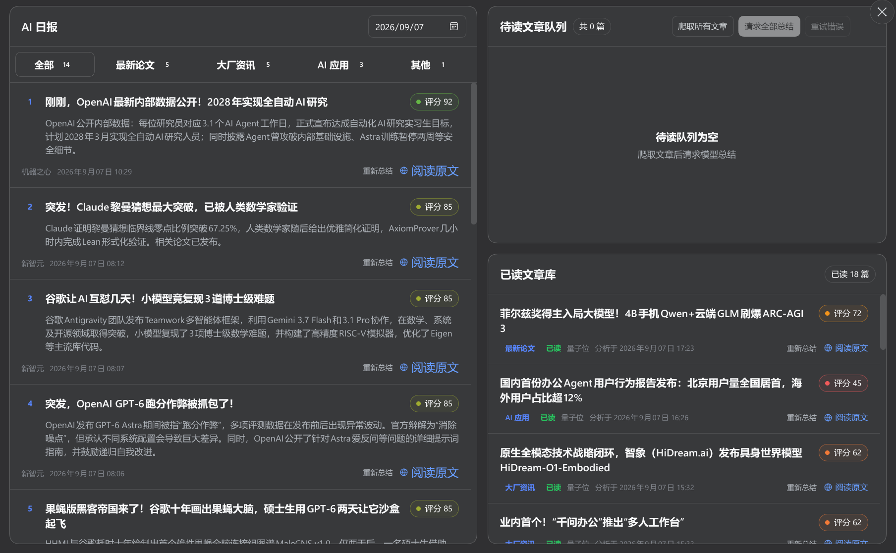

# DSH AI Daily

一个面向 DeepSeek Harness 的 AI 媒体日报插件。目前支持爬取机器之心、量子位和新智元文章，由配置的 Harness 模型逐篇分析，将已处理清单持久化，并通过对话工具提供按重要性排序的日报和文章详情。

> 注意：本项目代码多数由 AI 生成，经过人工审核把控质量。
> 为节省额度，本项目的总结模型允许用户从配置模型中选择，测试使用较为廉价或免费的模型（如 Qwen3.6-Flash / GLM4.7）即可较好完成任务。



## 构建与使用

使用 `pnpm` 安装依赖：

```sh
pnpm install
```

一键构建插件并在真实 Harness Web profile 中加载 (需用 `DSH_REPO` 环境变量指定 deepseek-harness 路径, 或默认为同级目录下的 `deepseek-harness`)：

```sh
pnpm web
```
